# Electron 学习笔记
## 脚手架安装:
两个脚手架安装项目,其README文件安装的步骤可细读:
### [electron-quick-start](https://github.com/electron/electron-quick-start)
### [electron-forge](https://github.com/electron-userland/electron-forge)

## 配置环境的补充: 
无论上面哪个脚手架安装, `npm install`或`electron-forge init my-app`, 发现下载不了, 众所周知国内环境的原因, 可直接运行`yarn`安装, 或设置淘宝镜像后再 `npm install`
```bash
npm config set ELECTRON_MIRROR https://npm.taobao.org/mirrors/electron/
```
## 自行配置Electron
```bash
npm i -g electron
mkdir electron-learn && cd electron-learn
touch index.html index.js
code .
```
基础目录结构:  
```jsx
main.js // 定义主进程(main process)的js文件, 主进程只有一个, 控制软件窗口的操作等
render.js //  定义渲染进程(render process)文件, 即前端的界面的js文件,可以有多个
index.html  // 渲染的根页面
```
具体代码见各个文件及注释\[render process demo\], 下面的演示均用自行配置的Electron运行:

## 调试工具:
以下调试工具也可直接参考[官方文档调试工具](https://www.electronjs.org/docs/tutorial/debugging-main-process):

- 渲染进程调试工具如下可以点开如下:

  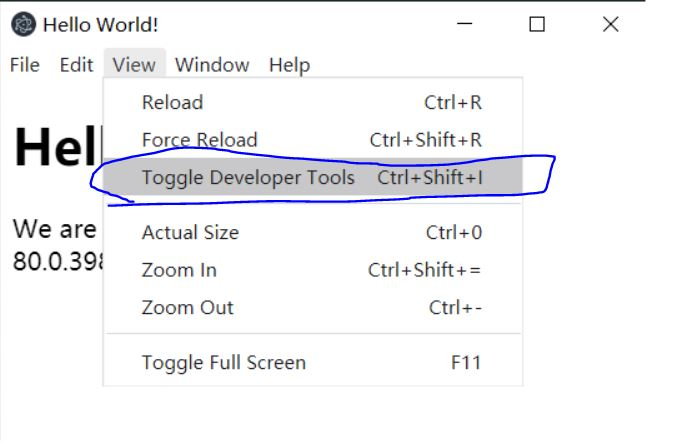

  和Chrome一样的调试工具:

  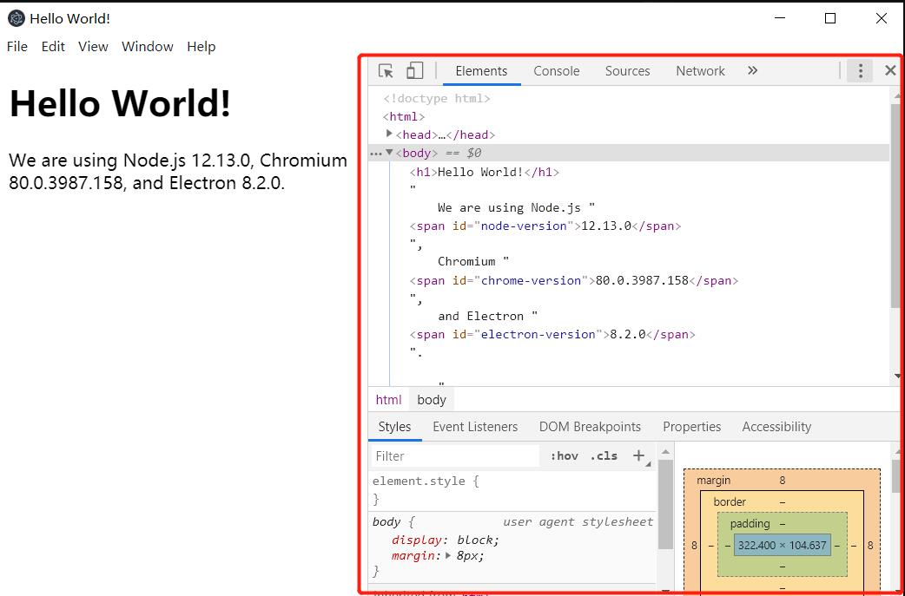

- 主进程调试工具  
  - 浏览器调试:  
  
  在 [package.json](./package.json) 更改 `start` 脚本, 如下: 其中8888为自定义端口, 不写的话默认`5858`端口

  ```json
  "start": "electron --inspect=8888 ."
  ```
  重新 `npm start`:
  
  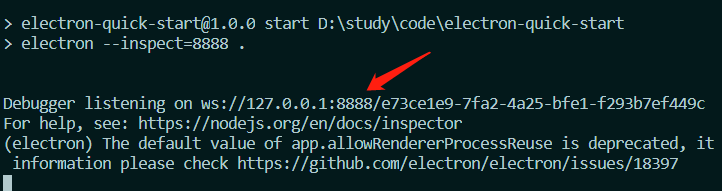

  2. Chrome浏览器地址栏里输入: `chrome://inspect/#devices` ,出现如下, 

  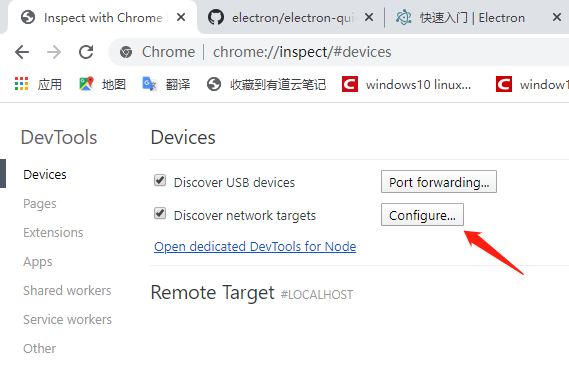
  
  点击Configure, 出现如下, 输入`localhost:8888`, 点击Done, 这样就配置好了
  
  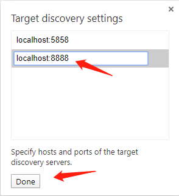
  
  重启`npm start`, 此时会界面就会出现监视的主程序文件[main.js](./main.js), Electron只有一个主程序入口
  
  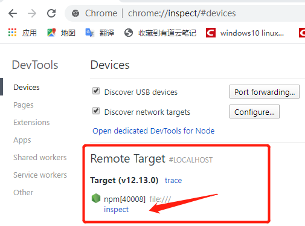
  
  点击上面的inspect,就会出现调试窗口:
  
  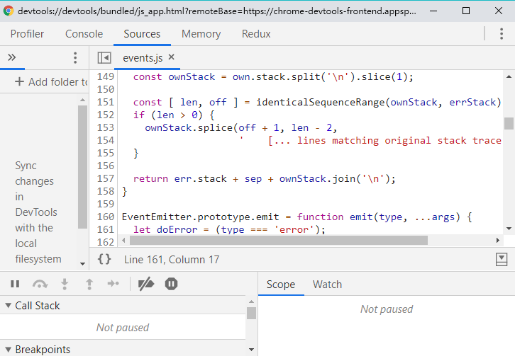

  - vs code调试:

    - vs code左边栏点击的,再点击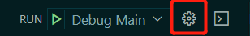, 会出现`.vscode/launch.json`文件

    - 将该文件替换为以下配置:
    ```json
    {
      "version": "0.2.0",
      "configurations": [
        {
          "name": "Debug Main Process",
          "type": "node",
          "request": "launch",
          "cwd": "${workspaceFolder}",
          "runtimeExecutable": "${workspaceFolder}/node_modules/.bin/electron",
          "windows": {
            "runtimeExecutable": "${workspaceFolder}/node_modules/.bin/electron.cmd"
          },
          "args" : ["."]
        }
      ]
    }
    ```

    - 设置一些断点, 在[main.js](./main.js)的关闭按钮逻辑代码行前单击, 会出现断点:
    
    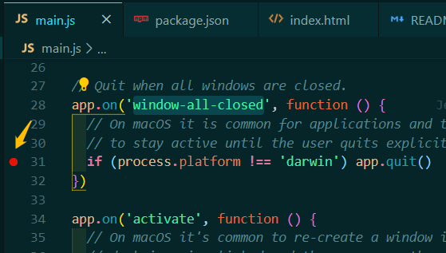
    
    工具栏也会显示你打断点:
    
    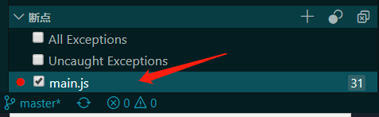

    点击左上角的Run就会出现如下图操作:
    
    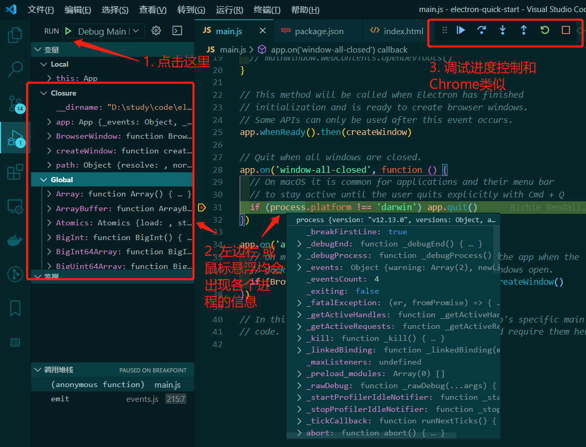


## 常用[主线程事件](https://www.electronjs.org/docs/all#%E4%BA%8B%E4%BB%B6):
-  ready: 完成初始化时触发  
window-all-closed: 所有窗口被关闭  
before-quit: App开始关闭窗口之前触发  
wiil-quit: 所有窗口已关闭且应用程序将退出时触发  
quit: 应用程序退出时触发  

- [webContents常用事件](https://www.electronjs.org/docs/all#%E7%B1%BB-webcontents):  
did-finish-load: 导航完成时触发,即选项卡的旋转器将停止旋转,并指派onload事件后  
dom-ready: 一个框架中的文本加载完成后触发该事件

- 以上demo 见主程序注释\[常用主程序事件\]: [main.js](./main.js)

## 常用[进程 api (process api)](https://www.electronjs.org/docs/api/process)  
- 由于软件装在用户机, 用户电脑及平台的配置各异, 所以需通过process api拿到用户信息,以便对开发出来的软件做出分析
- demo见[index.html](./index.html) 注释 \[进程 api\]

## [File 对象](https://www.electronjs.org/docs/api/file-object)
- 处理上传文件的操作
- demo见注释\[File 对象\]

## [<webView>标签](https://www.electronjs.org/docs/api/webview-tag)
- 内嵌网页tab标签, 实现步骤：v5.0版本之后, 主线程文件`main.js`的`new BrowserWindow`的`webPreferences`里配置: `webviewTag: true`
- 其和`<iframe></iframe>`的区别, webview是单独开了一个进程,可以像主进程一样指定`nodeIntegration: true`，让网页可以直接写node代码的能力，即可直接操作文件, [使用方法](https://www.electronjs.org/docs/api/webview-tag#nodeintegration)
- 能使用新的脚本覆盖，嵌入到webView的网页中，[用法](https://www.electronjs.org/docs/api/webview-tag#preload)，`<webview preload="./test.js"></webview>`
- 其他常用api: [<webview>.insertCSS(css)](https://www.electronjs.org/docs/api/webview-tag#webviewinsertcsscss), [<webview>.executeJavaScript(code[, userGesture])](https://www.electronjs.org/docs/api/webview-tag#webviewexecutejavascriptcode-usergesture), [<webview>.isDevToolsOpened()](https://www.electronjs.org/docs/api/webview-tag#webviewisdevtoolsopened)